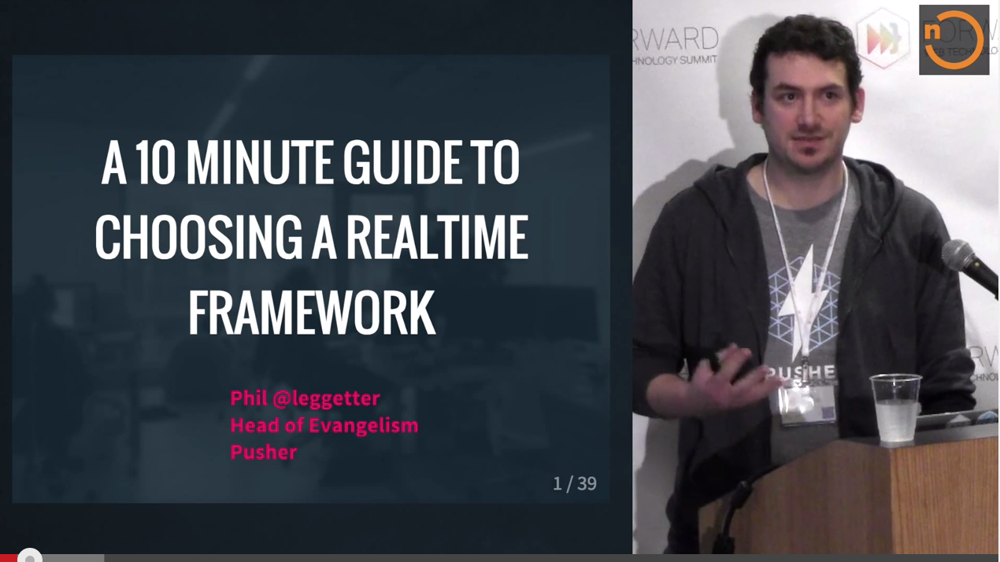

name: lblue
layout: true

class: bg-light, center, middle

---

class: title

# So, you want to build a Real-time API. Where do you start?

* Phil @leggetter
* Head of Evangelism
* 

???

---

# What we'll cover

* 5 Reasons you should offer a Real-Time API
* Transports
* Communication Patterns
* Real-Time API Quiz
* Frameworks
* Tools
* Security
* Scaling

---

class: bg-dark

# 5 Reasons you should offer a Real-Time API

---

# 1. Faster access to business value

???

* Simple
* The sooner your API consumers can have the data the sooner they gain the business value if offers.

---

# 2. Some Data has a Time Factor

---

background-image: url(./img/warp-core.gif)
class: em-text, trans-h, top

# WCaaS

--

## Warp Core as a Service

---

background-image: url(./img/core-breach.gif)

---

## Time Factor

* Monitoring
* Market data & betting
* Short-lived deals/offers
* Communications e.g. phone calls & chat

---

# 3. Developer Empowerment + Convenience

---

background-image: url(./img/developers-want-realtime.png)
class: center, bg-cover, em-text, trans-h, top

## Developers Want Real-Time

[leggetter.co.uk/2012/11/06/developers-want-realtime.html](http://www.leggetter.co.uk/2012/11/06/developers-want-realtime.html)

---

## Deliver the new or updated information to them (Push)

---

# 4. Users Expect Real-Time Experiences

---

class: em-text, bg-cover, trans-h, top
background-image: url(./img/itv-news-may-2014.png)

# Notifications & Signalling

---

class: bg-video, em-text, trans-h, top, vid-width-100

# Analytics/Visualizations

<video id="video" autoplay="true" loop="true">
	<source src="./img/librato.mp4" type="video/mp4">
</video>

---

class: center, bg-cover, em-text, trans-h, top
background-image: url(./img/delighted-app.gif)

# Activity Streams

???

* a stream of activity
* things have - and are - happening
* synonymous with social apps

---

class: bg-dark, bg-cover, em-text, trans-h, top
background-image: url(./img/sprintly.jpg)

# Multi-User Collaboration

???

---

## Enable your customers to Build Apps with Real-Time Features

---

# 5. A Mixture

* Quick business value
* Time Factor/Constraints
* Developer convenience
* Building Real-Time features

---

class: bg-dark

# Real-Time API Transports

???

* How do you deliver the real-time data to your API consumers
* 6 low-level possibilities

---

class: bg-dark

## Factor to consider

* API Consumer? Server or Client
* Message update frequency
* Direction of communication
* Message latency
* Efficiency

---

class: bg-dark

## WebHooks

---

class: bg-dark

## WebHooks

* Server only
* Low update rates
* Uni-directional
* Avg. latency
* Avg. efficiency

---

background-image: url(./img/polling.png)

---

class: bg-dark

## HTTP Polling

* Server or Client
* Low update rates
* Batched bi-directional
* High latency
* Low efficiency

---

background-image: url(./img/long-polling.png)

---

class: bg-dark

## HTTP Long-Polling

* Server or Client
* Avg. update rates
* Batched bi-directional
* Avg. latency
* Avg. efficiency

---

background-image: url(./img/streaming.png)

---

class: bg-dark

## HTTP Streaming

* Server or Client
* High update rates
* Uni-directional
* Low latency
* High efficiency

---

## Server-Sent Events

If you're considering either HTTP Long-Polling or HTTP Streaming then align with the
[Server-Sent Events standard](http://www.w3.org/TR/2009/WD-eventsource-20091029/).

---

background-image: url(./img/websocket.png)

---

class: bg-dark

## WebSocket

* Server or Client (normally client)
* High update rates
* Bi-directional
* Low latency
* High efficiency

---

class: bg-dark

## WebRTC

---

class: bg-dark

## WebRTC

* Server or Client (normally client to client)
* High update rates
* Bi-directional
* Low latency
* High efficiency

---

class: bg-dark

# Real-Time Communication Patterns

???

---

## Real-Time Communication Patterns

* Simple messaging
* Publish-Subscribe
* RPC/RMI
* Data Sync

???

---

## Simple messaging

No abstractions. Just messages.

* Fits well with HTTP/REST :)
* Many persistent connections :(
* Single connection + complex data = message complexity :(

???

* Keep existing RESTful GET endpoints
* Allow GET requests to be long-held
* Infrastructure to support connections
* Clients need to make many connections

---

## PubSub

Subscribe & Publish on "channels"

* URLs can identify "channels" :)
* Many persistent connections :(
* New endpoint + Protocol required for efficiency :(
* Clearly partitions complex data :)
* Requires SDK

???

* Efficient PubSub requires push over single connection
* WebSocket required if subscriptions change frequently
* Or client publishes frequently

---

## RPC/RMI

Call API "methods"

* New endpoint + Protocol required for efficiency :(
* SDK required
* Hides network activity from developer

???

*

---

## Data Sync

Interact with, and synchronize, data structures

* New endpoint + Protocol required for efficiency :(
* New paradigm
* SDK required
* Hides network activity from developer

???

* 

---

background-image: url(./img/rtw-api-decision-matrix-bg-white.png)

---

# Real-Time API Quiz
## Example Scenarios

1. What transport?
2. What communication pattern?
3. What's the company?

---

class: top

## Scenario 1

* Predefine query within service
* Push to servers
* Frequent data updates
* Potentially large message payloads

--
* **HTTP Streaming**

--
* **Simple messaging**

--

---

class: top

## Scenario 2

* Push to server
* Occasional data updates ("events")
* Delivery within ~1 of event

--
* **WebHooks**

--
* **Simple messaging**

--

---

class: top

## Scenario 3

* Push to browsers, native mobile & anywhere
* Frequent data updates ("events")
* Delivery within 250ms
* Partitioned data

--
* **WebSocket** + HTTP fallback

--
* **PubSub** + events

--

---

class: top

## Scenario 4

* Multi-device comms via central storage
* Frequent data updates
* Delivery within 1s

--
* **WebSocket** (+ HTTP Streaming)

--
* **Data Sync**

--

---

class: bg-white
background-image: url('./img/apps-with-realtime-apis.png')

???

* This image shows only "apps" with realtime APIs
* Not included API services - Pusher, Twilio, SendGrid, MailJet, Firebase etc.

---

class: bg-dark

# Real-Time API Frameworks

???

---

class: bg-white
background-image: url(./img/realtime-web-solutions-updated.png)

---

class: top

## Choose one that meets your requirements

How do you do that?

--

1. Choose one that offers the functionality you need
--

2. Watch my videos :)

---

background-image: url(./img/rtw-tech-decision-matrix-solutions.png)

---

class: bg-dark

# Real-Time API Tools

???

---

## Are there any?

---

todo

---

class: bg-dark

# Securing Real-Time APIs

???

---

todo

---

class: bg-dark

# Scaling Real-Time APIs

???

---

todo

---

## Resources

* http://pusher.com - easily add realtime messaging to your apps

---

class: title

# So, you want to build a Real-time API. Where do you start?

## Questions?

[leggetter.github.io/realtime-apis](http://leggetter.github.io/realtime-apis)

* Phil @leggetter
* Head of Evangelism
* 
